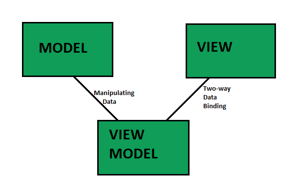

# Software Architecture Angular

### MVVM ( Model View View Model )



- **MODEL:**( Reusable Code – DATA ) Business Objects that encapsulate data and behavior of application domain, Simply hold the data.
- **VIEW:** ( Platform Specific Code – USER INTERFACE ) What the user sees, The Formatted data.
- **VIEWMODEL:** ( Reusable Code – LOGIC ) Link between Model and View OR It Retrieves data from Model and exposes it to the View. This is the model specifically designed for the View.

### Model

```
export interface User {
    id: number;
    name: string;
    email: string;
}
```

### ViewModel

```
import { Injectable } from '@angular/core';
import { User } from './user.model';

@Injectable({
  providedIn: 'root',
})
export class UserService {
  private user: User = {
    id: 1,
    name: 'John Doe',
    email: 'john.doe@example.com'
  };

  getUser(): User {
    return this.user;
  }

  updateUser(userData: User): void {
    this.user = userData;
  }
}
```

### View

```
import { Component } from '@angular/core';
import { User } from '../user.model';
import { UserService } from '../user.service';

@Component({
  selector: 'app-user-profile',
  templateUrl: './user-profile.component.html',
  styleUrls: ['./user-profile.component.css']
})
export class UserProfileComponent {
  user: User;

  constructor(private userService: UserService) {
    this.user = this.userService.getUser();
  }

  updateUser(): void {
    this.userService.updateUser(this.user);
  }
}
```

```
<div>
  <h2>User Profile</h2>
  <form>
    <label>ID: {{user.id}}</label><br>
    <label>Name:</label>
    <input [(ngModel)]="user.name" type="text"><br>
    <label>Email:</label>
    <input [(ngModel)]="user.email" type="email"><br>
    <button type="button" (click)="updateUser()">Update</button>
  </form>
</div>

```
